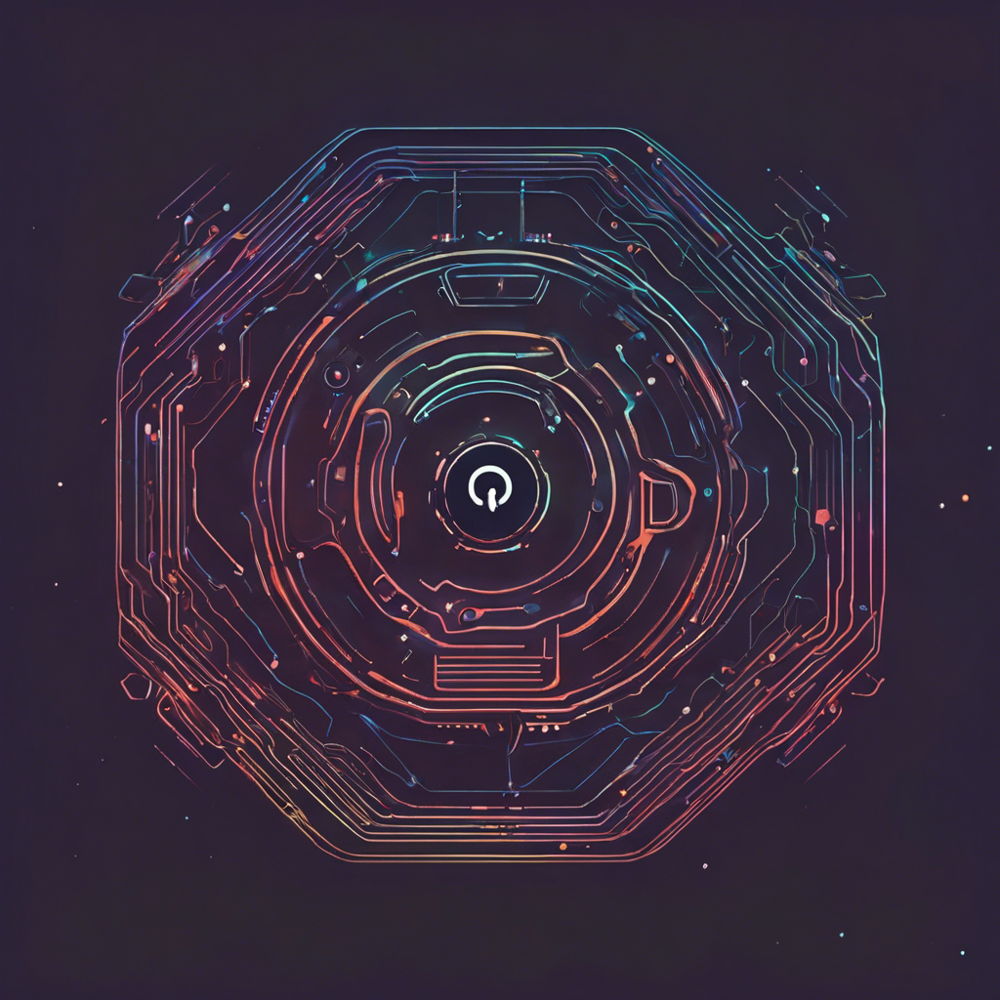

# EraAI: The Dawn of Collaborative Intelligence

EraAI represents a groundbreaking venture into the future of human-AI collaboration. This innovative platform is meticulously crafted to serve as an equal to human intellect, enhancing decision-making and uncovering unique solutions. Harnessing the formidable capabilities of sophisticated AI, EraAI is not just an addition to the human workflow but a significant enhancement, providing real-time insights and proactive support.

The essence of EraAI lies in its multi-tiered AI architecture, which integrates the management prowess of Pinokio, the autonomous structuring of HAAS, and the directive clarity of CommandAI. This powerful combination ensures that each AI agent not only adheres to ethical standards and organizational hierarchies but also evolves with the ever-changing demands of their human collaborators.

EraAI transcends the conventional role of a tool, emerging as a thought-provoking partner that inspires innovation, challenges conventional thinking, and occasionally keeps you on your toes with its snarky edge. It is the perfect companion for visionaries poised to lead in the AI era, offering the necessary intelligence and backing to remain at the forefront of their fields.

Embark on this transformative journey with us. Embrace the EraAI, where the narrative of human and AI partnership is just beginning to unfold.
